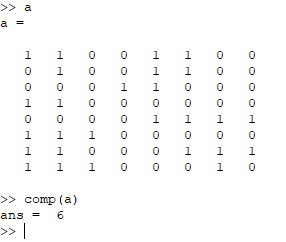

# MATLAB-Image-Component

### Image Processing

Finding 4-Way connected components in a BW Image.
--------
* I have taken a matrix `a` which in similar to 2-D pixel array of an BW image containing 1 & 0.
* DFS technique is used to count all the components.

  

